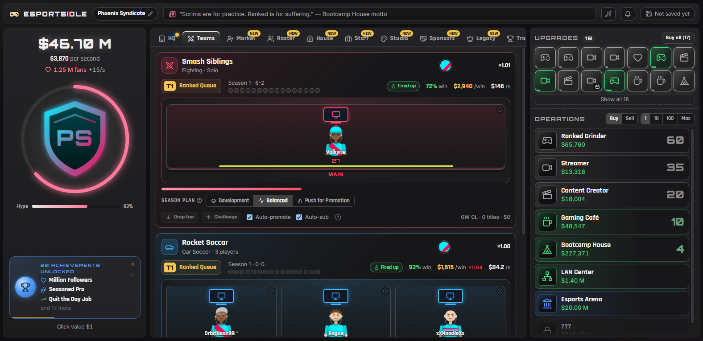

# Esports Idle

An incremental management game where you turn a scrappy garage squad into an orbital esports dynasty.

Click the logo to build crowd hype, scout mechanical prodigies on the transfer market, kit them out with liquid-cooled rigs, and watch them battle through 16-game seasons across 12 parody titles. Behind the stage, fund your teams with a commercial empire spanning ranked grinders, streaming houses, custom merchandise lines, and high-risk sponsorships.

**Play directly in your browser:** https://hazzjc.github.io/esportsidle/



## The Core Loop

Esports Idle runs on two interlocking engines:

### 1. The Active Roster
Sign procedurally generated players across multiple competitive titles, from solo fighters in *Smash Siblings* to tactical 5v5 squads in *Counter-Strike* parodies.
* **Scout and Sign**: Hunt the transfer market for generational talent. Every rookie comes with their own stat distribution, skill ceiling, personality traits, and salary demands.
* **Kit Out Rigs**: Upgrade 10 gear slots per player across 16 tiers, taking your roster from hand-me-down CRT monitors to quantum computing clusters and lucky charm desk ornaments.
* **Manage the Season**: Set team tactical plans (Development, Balanced, or Push for Promotion). Chase promotion, dodge relegation, manage player burnout, and capture season championship trophies.
* **Navigate Rivalries**: Face off against persistent rival organizations that track your head-to-head records and trigger high-stakes grudge matches.

### 2. The Commercial Empire
Matches need prize money, and players need salaries. Build an automated business network that generates cash every second, even when you are away:
* **16 Tiered Operations**: Scale your revenue from solo Ranked Grinders and Streamers up to regional Bootcamp Houses, LAN Centers, and Multiverse Arenas.
* **Custom Pixel Studio**: Design your own crest, logo, and jersey patterns inside the built-in pixel editor. Your artwork appears directly on player jerseys and in your official merch shop.
* **Merch Store**: Launch 10 product lines, balance pricing sweet spots against market trends, and capitalize on viral hype waves.
* **Sponsorship Deals**: Sign contracts with 36 parody brands across 12 categories. Chase performance bonuses, balance brand exclusivity, and decide whether risky crypto sponsorships are worth the gamble.

## Hype, Drama, and Metagame

* **Logo Clicker and Click Chains**: Clicking your team crest fills the hype meter to spark *Crowd Goes Wild* multipliers. Pop floating hype bubbles in real time to stack chain bonuses up to 20x.
* **Hype Drops and World Events**: Click golden drops for sudden cash spikes, tournament bracket invites, and viral surges. Respond to balance patches, player contract drama, and hardware shortages.
* **Prestige and Legacy**: When your org reaches the top, sell the franchise to earn Legacy Points. Unlock permanent perks on a 37-node Legacy Tree, pick unique Founding Charters, carry forward franchise players, and tackle themed challenge runs.

## Saves and Privacy

The game autosaves directly to browser localStorage and keeps rolling automatic backups. You can export or import your save string at any time in the Options tab. No accounts, no logins, no tracking.

## Running Locally

Requires Node 22+.

```bash
npm install
npm run dev      # run local development server
npm test         # run Vitest test suite
npm run check    # run Svelte and TypeScript diagnostics
npm run build    # build production bundle
```

All game titles, organizations, and sponsor brands featured in the game are fictional parodies.
