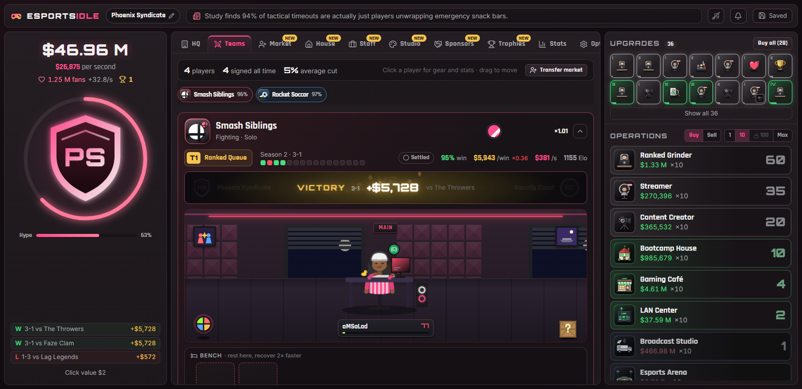

# Esports Idle

An incremental management game where you turn a scrappy garage squad into an orbital esports dynasty.

Click the logo to build crowd hype, scout mechanical prodigies on the transfer market, kit them out with liquid-cooled rigs, and watch them battle through 16-game seasons across 12 parody titles. Behind the stage, fund your teams with a commercial empire spanning ranked grinders, streaming houses, custom merchandise lines, and high-risk sponsorships.

**Play directly in your browser:** https://hazzjc.github.io/esportsidle/



## A Guided First Run

New orgs are walked through the whole game in order. A quest line on the HQ console opens each system as it explains it (the transfer market, Staff, the House, the Pixel Studio, Sponsors), shows what it is waiting on, and pulses whatever to press next. Every tutorial step and quest has a **Show me** button. Finishing a quest earns a perk for that run.

## The Core Loop

Esports Idle runs on two interlocking engines:

### 1. The Active Roster
Sign procedurally generated players across multiple competitive titles, from solo fighters in *Smash Siblings* to tactical 5v5 squads in *Counter-Strike* parodies.
* **Scout and Sign**: Hunt the transfer market for generational talent. Every rookie comes with their own stat distribution, skill ceiling, personality traits, and salary demands.
* **Kit Out Rigs**: Upgrade 10 gear slots per player across 16 tiers, taking your roster from hand-me-down CRT monitors to quantum computing clusters and lucky charm desk ornaments.
* **Manage the Season**: Set team tactical plans (Development, Balanced, or Push for Promotion). Drag players between the lineup and the bench, rest the injured, chase promotion on team Elo, dodge relegation, and capture season championship trophies.
* **Watch Them Play**: Every team has its own room that follows your house, dressed with props parodying its game. Players type at their desks with their lucky charm beside them, and each match shows your crest against the next opponent's, ending in a victory card that counts up the prize money.
* **Navigate Rivalries**: Face off against persistent rival organizations that track your head-to-head records and trigger high-stakes grudge matches.

### 2. The Commercial Empire
Matches need prize money, and players need salaries. Build an automated business network that generates cash every second, even when you are away:
* **16 Tiered Operations**: Scale your revenue from solo Ranked Grinders and Streamers up to regional Bootcamp Houses, LAN Centers, and Multiverse Arenas.
* **Staff**: Hire a Coach, Chef, Scout, Analyst, Talent Agent, Social Media Manager and Merch Designer. Your first hire of each role brings a quality-of-life tool, such as buying 10 or 100 at a time, Max, and Buy all upgrades.
* **The House**: Move from a garage up to an orbital station, fill each house with decor, and get a move-in card every time the org outgrows its home.
* **Custom Pixel Studio**: Design your own crest, logo, and jersey patterns inside the built-in pixel editor. Your artwork appears directly on player jerseys and in your official merch shop.
* **Merch Store**: Launch 10 product lines, balance pricing sweet spots against market trends, and capitalize on viral hype waves.
* **Sponsorship Deals**: Start with a choice of three snack brands, then sign contracts with 36 parody brands across 12 categories. Chase performance bonuses, balance brand exclusivity, and decide whether risky crypto sponsorships are worth the gamble.

## Hype, Drama, and Metagame

* **Logo Clicker and Click Chains**: Clicking your team crest fills the hype meter to spark *Crowd Goes Wild* multipliers. Pop floating hype bubbles in real time to stack chain bonuses up to 20x.
* **Hype Drops and World Events**: Click golden drops for sudden cash spikes, tournament bracket invites, and viral surges. Enter invitationals with a cash stake and the odds in plain view. Respond to balance patches, player contract drama, and hardware shortages.
* **Prestige and Legacy**: When your org reaches the top, sell the franchise to earn Legacy Points. Unlock permanent perks on a 45-node Legacy Tree, pick unique Founding Charters, carry forward franchise players, and tackle themed challenge runs.

## Saves and Privacy

The game autosaves directly to browser localStorage and keeps rolling automatic backups. You can export or import your save string at any time in the Options tab. No accounts, no logins, no tracking.

## Running Locally

Requires Node 22+.

```bash
npm install
npm run dev      # run local development server
npm test         # run Vitest test suite
npm run check    # run Svelte and TypeScript diagnostics
npm run build    # build production bundle
```

All game titles, organizations, and sponsor brands featured in the game are fictional parodies.
